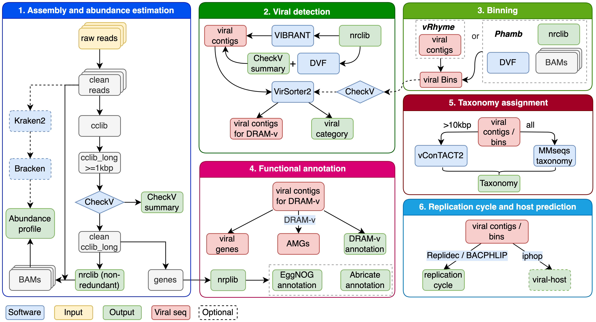

# ViroProfiler: a containerized bioinformatics pipeline for viral metagenomic data analysis

[](https://www.nextflow.io/)
[](https://docs.conda.io/en/latest/)
[](https://www.docker.com/)
[](https://sylabs.io/docs/)
[](https://zenodo.org/badge/latestdoi/537899739)

```
                                        __
oooooo     oooo oo                    88  88                    .o8o.  oo  ooo
 `888.     .8'  `'                   88 ss 88                   88 `"  `'  `88
  `888.   .8'  ooo  ooood8b  o888o    88__88   ooooo8b  o888o  o88o   ooo   88   .oooo.  ooooo8b
   `888. .8'   `88   88""8P d8' `8b     ||      88""8P d8' `8b  88    `88   88  d8'  `8b  88""8P
    `888.8'     88   88     88   88    _||_     88     88   88  88     88   88  888ooo88  88
     `888'      88   88     88   88  // || \\   88     88   88  88     88   88  88    .o  88
      `8'      o88o o88b     o888o  //      \\ d88b     o888o  o88o   o88o o88o `Y8bd8P' 088b

```

## Introduction

ViroProfiler is a bioinformatics best-practice analysis pipeline for viral metagenomics data analyses.

The pipeline is built using [Nextflow](https://www.nextflow.io), a workflow tool to run tasks across multiple compute infrastructures in a very portable manner. It uses Docker/Singularity containers making installation trivial and results highly reproducible.



## Quick Start

1. Install [`Nextflow`](https://www.nextflow.io/docs/latest/getstarted.html#installation) (`>=21.10.3`)

2. Install [`Singularity`](https://www.sylabs.io/guides/3.0/user-guide/) (you can follow [this tutorial](https://singularity-tutorial.github.io/01-installation/)) or [`Docker`](https://docs.docker.com/engine/installation/). Other  [`Podman`](https://podman.io/), [`Shifter`](https://nersc.gitlab.io/development/shifter/how-to-use/) or [`Charliecloud`](https://hpc.github.io/charliecloud/) for full pipeline reproducibility. However, only `Docker` and `Singularity` were tested. _(you can use [`Conda/Mamba`](https://mamba.readthedocs.io/en/latest/installation.html) both to install Nextflow itself and also to manage software within pipelines. Please only use it within pipelines as a last resort; see [docs](https://nf-co.re/usage/configuration#basic-configuration-profiles))_.

3. Download the pipeline and database.

   ```bash
   nextflow run deng-lab/viroprofiler -profile <YOURPROFILE>

   # ex.
   # nextflow run deng-lab/viroprofiler -profile singularity
   ```

   By default, database will be downloaded to the `$HOME/viroprofiler` directory. You can change database path using the `--db` parameter. For example, if you want to download the database to `/db/path` directory, you can run the pipeline as follows:

   ```bash
   nextflow run deng-lab/viroprofiler -profile <YOURPROFILE> --db /db/path
   ```

   > - If you are using `Singularity`, please set the [`NXF_SINGULARITY_CACHEDIR` or `singularity.cacheDir`](https://www.nextflow.io/docs/latest/singularity.html?#singularity-docker-hub) Nextflow options enables you to store and re-use the images from a central location for future pipeline runs.
   > - If you are using `Docker`, please replace the profile with `docker`: `-profile docker`.
   <!-- > - If you are using `conda`, it is highly recommended to use the [`NXF_CONDA_CACHEDIR` or `conda.cacheDir`](https://www.nextflow.io/docs/latest/conda.html) settings to store the environments in a central location for future pipeline runs. -->

4. Test the pipeline on a minimal dataset,

   ```bash
   nextflow run deng-lab/viroprofiler -profile test,<YOURPROFILE>

   # ex.
   # nextflow run deng-lab/viroprofiler -profile test,singularity
   ```

   Note that some form of configuration will be needed so that Nextflow knows how to fetch the required software. This is usually done in the form of a config profile (`YOURPROFILE` in the example command above). You can chain multiple config profiles in a comma-separated string.

   > - The pipeline comes with config profiles called `docker`, `singularity`, `podman`, `shifter`, `charliecloud` and `conda` which instruct the pipeline to use the named tool for software management. For example, `-profile test,docker`.
   > - Please check [nf-core/configs](https://github.com/nf-core/configs#documentation) to see if a custom config file to run nf-core pipelines already exists for your Institute. If so, you can simply use `-profile <institute>` in your command. This will enable either `docker` or `singularity` and set the appropriate execution settings for your local compute environment.

5. Start running your own analysis!

   You may create a config file to customize the parameters of the pipeline and use `-c` to load the config. Please check [custom.config](https://github.com/deng-lab/viroprofiler/blob/main/custom.config) for an example.
   
   You can also specify the parameters in a file and use `-params-file` to load the parameters. Please check [params.yml](https://github.com/deng-lab/viroprofiler/blob/main/params.yml) for an example.

   ```bash
   nextflow run deng-lab/viroprofiler --input samplesheet.csv -c custom.config -params-file params.yml -profile <docker/singularity/podman/shifter/charliecloud/conda/institute>

   # ex.
   # nextflow run deng-lab/viroprofiler --input samplesheet.csv -c custom.config -params-file params.yml -profile slurm,singularity
   ```

## Updating the pipeline

   ```bash
   nextflow pull deng-lab/viroprofiler
   ```

## Documentation

The ViroProfiler pipeline comes with documentation about the pipeline [usage](docs/usage.md), [parameters](params.yml) and [output](docs/output.md).

## Credits

ViroProfiler was originally written by Jinlong Ru.

We thank the following people for their extensive assistance in the development of this pipeline:

- ...

## Contributions and Support

If you would like to contribute to this pipeline, please see the [contributing guidelines](.github/CONTRIBUTING.md).

For further information or help, please [open an issue](https://github.com/deng-lab/viroprofiler/issues).

## Citations

If you use  ViroProfiler for your analysis, please cite the publication as follows:

> ViroProfiler: a containerized bioinformatics pipeline for viral metagenomic data analysis
>
> *Jinlong Ru, Mohammadali Khan Mirzaei, Jinling Xue, Xue Peng, Li Deng*
>
> [journal]

An extensive list of references for the tools and data used by the pipeline can be found in the [`CITATIONS.md`](CITATIONS.md) file.

This pipeline uses code and infrastructure developed and maintained by the [nf-core](https://nf-co.re) initative, and reused here under the [MIT license](https://github.com/nf-core/tools/blob/master/LICENSE). You can cite the `nf-core` publication as follows:

> The nf-core framework for community-curated bioinformatics pipelines.
>
> *Philip Ewels, Alexander Peltzer, Sven Fillinger, Harshil Patel, Johannes Alneberg, Andreas Wilm, Maxime Ulysse Garcia, Paolo Di Tommaso & Sven Nahnsen.*
>
> *Nat Biotechnol. 2020 Feb 13. doi: [10.1038/s41587-020-0439-x](https://dx.doi.org/10.1038/s41587-020-0439-x).*
